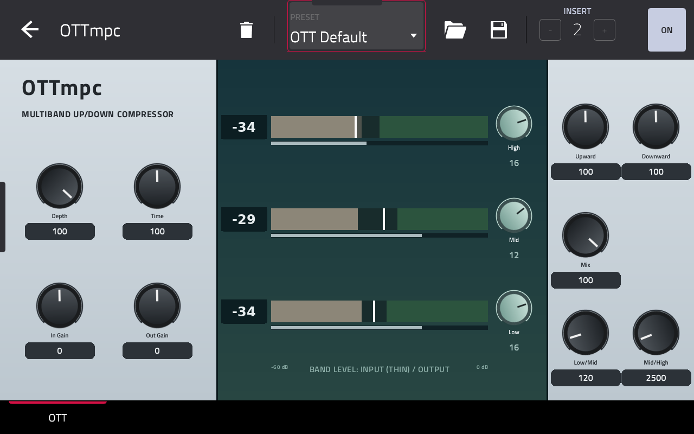

# OTTmpc

**Vital's OTT multiband compressor as an insert effect for MPC and Force.**

OTTmpc squeezes the loud parts down and lifts the quiet parts up, in three bands at once: the classic "OTT" sound,
now as a native effect on a track, with its own touchscreen skin, live band meters and ten presets.

## Features

- Three-band up/down compression (the OTT algorithm from Vital), with the Low/Mid and Mid/High crossovers adjustable.
- **Live meters** for each band: a thin input strip and the output bar over the band's upward (beige) and downward
  (green) zones, with the output level as a dB number.
- **12 controls**, all on the Q-Links (in this order):

  | Control | Range | What it does |
  |---|---|---|
  | Depth | 0 to 100 % | Overall amount of compression. 0 leaves the band gains only. |
  | Time | 0 to 200 % | Attack and release together: lower is faster. |
  | In Gain / Out Gain | -30 to +30 dB | Level into and out of the compressor. |
  | Upward | 0 to 200 % | How hard quiet material is lifted. |
  | Downward | 0 to 200 % | How hard loud material is pushed down. |
  | Mix | 0 to 100 % | Dry/wet, for parallel compression. |
  | High / Mid / Low gain | -30 to +30 dB | Make-up gain per band. |
  | Low/Mid, Mid/High | 20 to 1000 Hz, 1 to 18 kHz | The two crossover frequencies. |

- **10 presets** in MPC's PRESET menu: OTT Default, Flat (Bypass-ish), Gentle Glue, Parallel Smash, Upward Only,
  Downward Only, Drum Bus, Vocal Air, Bass Tighten and Lo-Fi Squash. Each sets all 12 controls.
- Light on CPU: worst block 6.5% of the audio budget on a Force, so several instances are fine.

## Requirements

- A first-generation MPC OS standalone device (32-bit ARM): Force, MPC Live / Live II, One, X or Key 61.
- MPC OS 3.x (the skin format needs it).
- **Root SSH access** to the device. Stock MPC OS doesn't offer it, so you need a modded unit.
- Tested on a Force only. Other models are untested. Installing plugins this way is unofficial: back up first and
  use it at your own risk.

## Install

1. Download `OTTmpc-1.0.0-mpc-armv7.zip` from the [Releases](https://github.com/sd88me/mpc-vst-OTT/releases) page and unzip it.
2. Copy the folder to the device: `scp -r OTTmpc-1.0.0 root@<device-ip>:/tmp/`
3. Run the installer: `ssh root@<device-ip> sh /tmp/OTTmpc-1.0.0/install.sh`.
   It **stops MPC**, so save your project first. It backs up `MPC.settings`, copies the plugin to `/sdcard/Synths`,
   registers it and starts MPC again.
4. On a track, add **OTTmpc** from the plugin browser (Insert effects). The Q-Links follow the screen.

To remove it, run `uninstall.sh` from the same folder. The zip's `INSTALL.md` also has manual steps.

## Using it

Start with the **OTT Default** preset and bring **Depth** up or down to taste. **Mix** below 100 % blends the
original back in (parallel compression). **Upward** and **Downward** shape the two halves of the sound separately.
Drum Bus, Vocal Air and Bass Tighten are good starting points for those sources.

The PRESET menu loads a preset. It sets all 12 controls, so tweaks made before picking one are replaced.

## Credits and licence

OTTmpc is built on other people's work:

- [vitOTTx](https://github.com/Sakhnovkrg/vitOTTx) by Sakhnovkrg: the OTT plugin whose DSP and parameter behaviour this port follows.
- vitOTT by Yegor Suslin, which vitOTTx is based on.
- [Vital](https://github.com/mtytel/vital) by Matt Tytel: the compressor and filter code underneath.
- [mpc-vst-plugins](https://github.com/sd88me/mpc-vst-plugins): the wrapper, build tools and skin renderer that turn an engine into an MPC plugin.

Licence: **GPL-3.0** (`LICENSE`), as the upstream code.

## For developers

- `src/vital_dsp/` is Vital's DSP, vendored from vitOTTx with only the JUCE header replaced (`src/VENDORED.md`).
  `src/engine.cpp` is the glue that follows vitOTTx's parameter mapping.
- Build with the tools in [mpc-vst-plugins](https://github.com/sd88me/mpc-vst-plugins), as a checkout next to this
  repo or with `MPC_VST=<path>` (needs its `build.cflags_arm` and `DISPLAY_REV_NO_UPDATE` support):

      "$MPC_VST/tools/test_port.sh" vst/vst.json    # x86 host test (ASan): PASSED
      vst/build.sh                                  # armhf .so + skin in vst/build/ (Docker)

- Presets are `vst/presets.json`. Skin art is drawn by `vst/art/make_art.py` (Pillow) to match `vst/layout.conf`;
  rerun it after changing either.
- The meters and the dB numbers are `picture` widgets on engine-driven option parameters, not filmstrip meters
  (wide bars as filmstrip frames would cost tens of MB of MPC's filmstrip cache). The engine reports them without a
  full-screen redraw (`DISPLAY_REV_NO_UPDATE`), because every redraw makes MPC rebuild the screen and close the
  PRESET popup. That is also why the dB numbers are pictures (2.5 dB steps) and not text.
