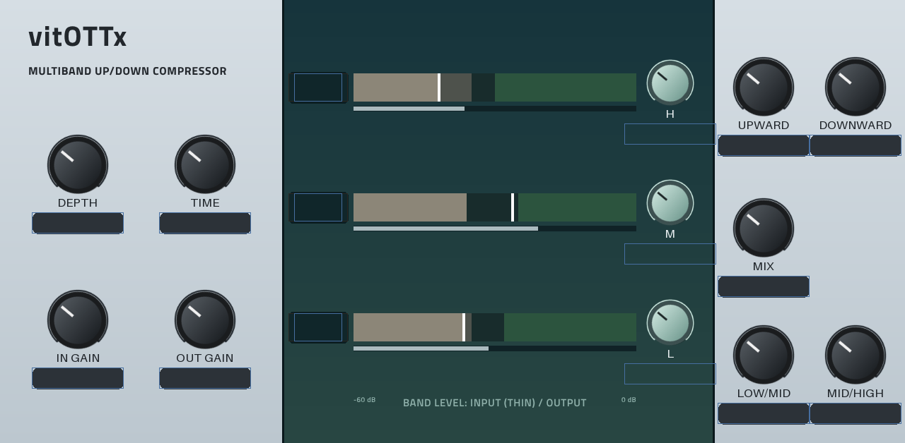

# OTTmpc (vitOTTx for MPC)

An insert-effect port of [vitOTTx](https://github.com/Sakhnovkrg/vitOTTx) (Vital's OTT multiband up/down
compressor) for MPC OS standalone devices, with an OTT-style skin and live per-band level meters.

- Engine: `src/vital_dsp/` vendored unchanged except for the JUCE header (`src/VENDORED.md`); `src/engine.cpp`
  is the `mpc_engine()` glue (as vitOTTx's processor: depth/upward/downward scale the band ratios, time sets attack
  and release, thresholds and ratios keep vitOTTx's defaults).
- Controls (Q-Links in this order): Depth, Time, In Gain, Out Gain, Upward, Downward, Mix, H/M/L band gain,
  Low/Mid and Mid/High crossover.
- Meters: per band, a thin input strip and the output bar over the band's upward (beige) and downward (green)
  zones, -60..0 dB in 24 steps, plus the output level as text. They are `picture` widgets on engine-driven option
  parameters (`HAS_DISPLAY_REV`), not filmstrip `meter`s: wide bars as square filmstrip frames would cost tens of MB
  of MPC's filmstrip cache per load (mpc-vst-plugins docs/NOTES.md "MPC's filmstrip cache").
- Presets (`vst/presets.json`, MPC's PRESET menu via vst.json `"presets"`): OTT Default, Flat (Bypass-ish), Gentle Glue,
  Parallel Smash, Upward Only, Downward Only, Drum Bus, Vocal Air, Bass Tighten, Lo-Fi Squash. Each sets all 12
  controls. "Flat" (depth 0, band gains 0 dB) passes audio unchanged (checked offline).
- Skin art: `vst/art/make_art.py` (Pillow) draws `vst/art/*.png` to match `vst/layout.conf`; rerun it after changing either.

Built with the tools in [mpc-vst-plugins](https://github.com/sd88me/mpc-vst-plugins) (a checkout next to this one, or
`MPC_VST=<path>`; it needs the `build.cflags_arm` vst.json key):

    "$MPC_VST/tools/test_port.sh" vst/vst.json    # x86, ASan: PASSED
    vst/build.sh                                  # armhf .so + skin in vst/build/ (Docker)

Licence: GPL-3.0 (`LICENSE`), as upstream.

 (offline render, meters lit by hand; not a device screenshot)
